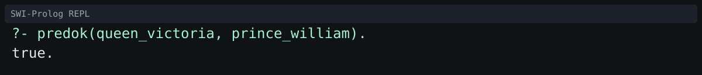
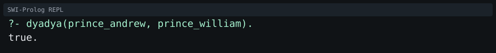
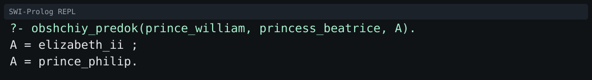
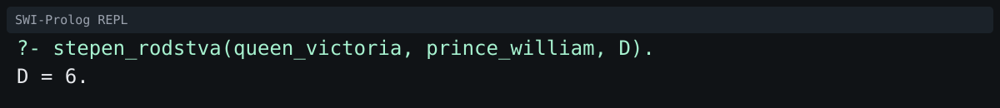
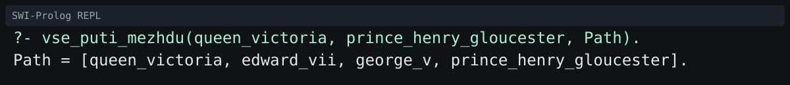
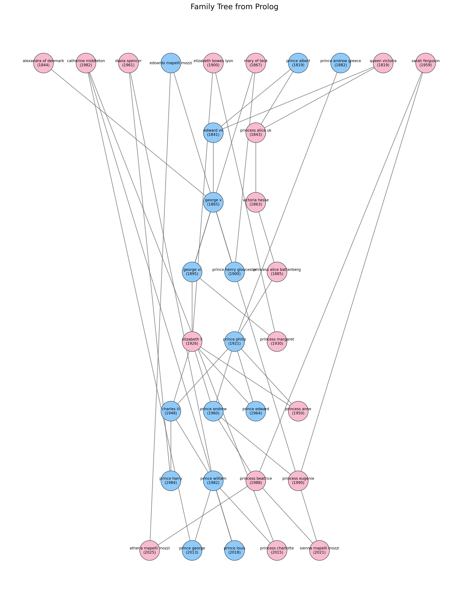

# Лабораторная работа №1 по дисциплине «Логическое программирование»

## Тема
Генеалогические отношения и рекурсивный вывод на языке Prolog.

## 1. Описание предметной области (чьё дерево)
В качестве предметной области выбрано **реальное семейное древо британской королевской семьи** с фокусом на Елизавету II.

В базу знаний включены:
- предки Елизаветы II (ветка от королевы Виктории);
- её супруг (принц Филипп) и его предковая линия;
- потомки Елизаветы II (Карл III, Уильям, Гарри и др.);
- боковая ветка семьи (ветка принца Эндрю: Беатрис, Евгения и дети Беатрис).

База покрывает более 30 реальных персон и более 7 поколений.

## 2. Структура базы знаний (факты и атрибуты)
Основной файл: `family.pl`.

### 2.1. Базовые факты
- `muzhchina/1` - факт о мужском поле персоны;
- `zhenshchina/1` - факт о женском поле персоны;
- `roditel/2` - отношение родитель -> ребёнок.

### 2.2. Расширенные атрибуты (уровень 2)
- `data_rozhdeniya/2` - дата рождения `date(Year,Month,Day)`;
- `data_smerti/2` - дата смерти;
- `mesto_rozhdeniya/2` - место рождения;
- `professiya/2` - роль/профессия (например, `monarch`, `royal`).

### 2.3. Организация данных
- данные записаны в виде атомов в `snake_case`;
- родственные связи задаются только через `roditel/2`, остальные отношения выводятся правилами;
- рекурсивные правила строятся от базового случая «родитель» к произвольной глубине.

## 3. Список реализованных предикатов с сигнатурами

### 3.1. Предикаты уровня 1
- `mat(X, Y)` - X мать Y;
- `otets(X, Y)` - X отец Y;
- `dedushka(X, Y)` - X дедушка Y;
- `babushka(X, Y)` - X бабушка Y;
- `brat(X, Y)` - X брат Y;
- `sestra(X, Y)` - X сестра Y;
- `dyadya(X, Y)` - X дядя Y;
- `tyotya(X, Y)` - X тётя Y;
- `predok(X, Y)` - X предок Y (рекурсивно);
- `potomok(X, Y)` - X потомок Y (через `predok/2`);
- `dvoyurodny_brat(X, Y)` - X двоюродный брат Y;
- `troyurodnaya_sestra(X, Y)` - X троюродная сестра Y.

### 3.2. Предикаты уровня 2 (анализ и валидация)
- `pokolenie(P, N)` - номер поколения персоны P;
- `obshchiy_predok(X, Y, A)` - ближайший общий предок A для X и Y;
- `stepen_rodstva(X, Y, D)` - минимальное расстояние между X и Y в графе родства;
- `net_ciklov` - проверка отсутствия циклов в дереве;
- `logichny_vozrasti` - проверка, что родитель старше ребёнка как минимум на 12 лет;
- `net_konfliktov_predkov` - отсутствие конфликтов «персона является своим предком».

### 3.3. Предикаты уровня 3
- `opisanie_rodstva(X, Y, Text)` - генерация текстового описания родства;
- `eksport_v_dot(FilePath)` - экспорт графа родства в формат DOT;
- `vse_puti_mezhdu(X, Y, Path)` - поиск всех путей между двумя персонами.

## 4. Примеры работы (скриншоты 5-7 запросов в REPL)
Скриншоты окна SWI-Prolog:

<table>
  <tr>
    <td>
      
    </td>
    <td>
      
    </td>
  </tr>
  <tr>
    <td>
      
    </td>
    <td>
      
    </td>
  </tr>
  <tr>
    <td colspan="2">
      
    </td>
  </tr>
</table>

## 5. Визуализация дерева (уровень 3)
Для визуализации используется скрипт `visualize_family.py` (интеграция Python + Prolog через `pyswip`, отрисовка через `networkx` и `matplotlib`).

Команда запуска:
```bash
python3 -m venv .venv
source .venv/bin/activate
pip install -r requirements.txt
python3 visualize_family.py --prolog family.pl --output family_tree.png --dot family_tree.dot
```

Результат визуализации:
<div class="tree-figure"></div>

## 6. Использованные интернет-источники
- ГОСТ 7.32-2017 (карточка стандарта): https://allgosts.ru/01/140/gost_7.32-2017
- ГОСТ 7.32-2017 (текст в справочной системе): https://docs.cntd.ru/document/1200157208
- Wikipedia, Elizabeth II: https://en.wikipedia.org/wiki/Elizabeth_II
- Wikipedia, Charles III: https://en.wikipedia.org/wiki/Charles_III
- Wikipedia, Queen Victoria: https://en.wikipedia.org/wiki/Queen_Victoria
- Wikipedia, Prince Philip: https://en.wikipedia.org/wiki/Prince_Philip,_Duke_of_Edinburgh
- Britannica, George VI: https://www.britannica.com/biography/George-VI
- Royal.uk (официальные профили): https://www.royal.uk/
